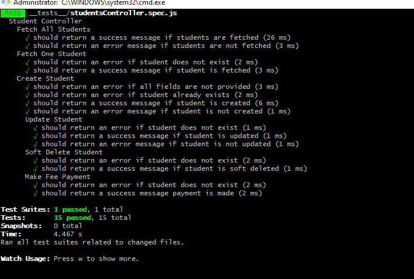

# Student Fee Management System API

## Endpoints

- Base URL: `http://localhost:3000/api`

```javascript
router.get('/', getStudents);
router.get('/:id', getStudentById);
router.post('/', createStudent);
router.put('/:id', updateStudent);
router.delete('/:id', softDeleteStudent);
router.post('/:id/payment', makeFeePayment);
```

## Tests Screenshot


